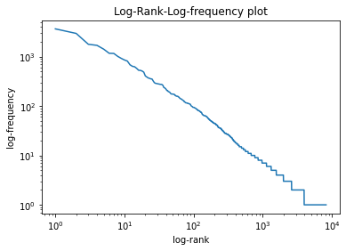

# Word-frequecy-analysis
In this mini project I did word frequency analysis and letter frequency analysis on Tow Sawyer (by Mark Twain) corpus from ProjectGutenberg. Checked the validity of Zipf's law by plotting log-log plot of frequency vs rank. Please find my [report](https://github.com/deepacefic/Word-frequecy-analysis/blob/master/Report.pdf) for more details and insights 

Zipf's law validation on Tom sawyer corpus from ProjectGutenberg.

